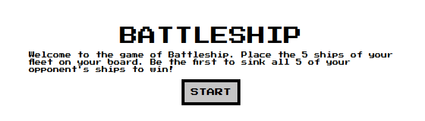
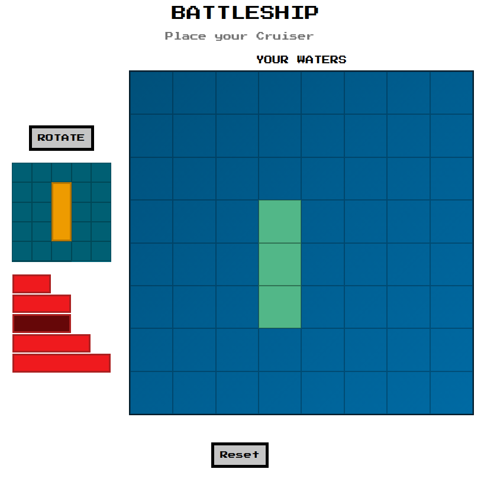
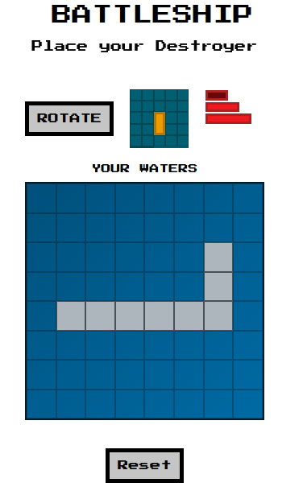
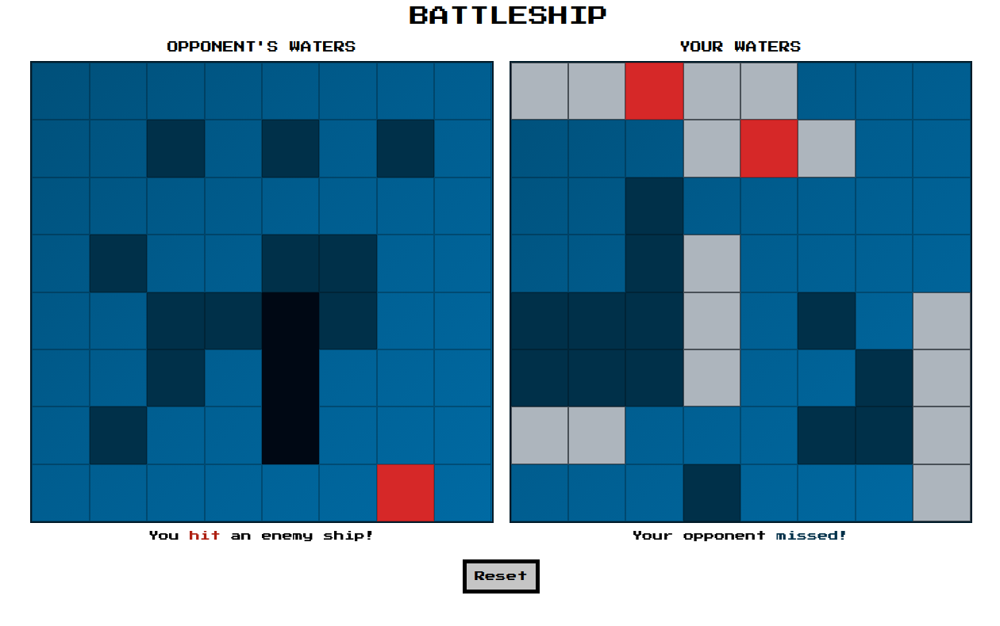
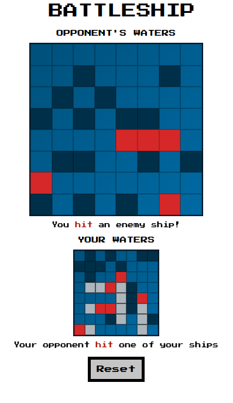

<!--
*** Thanks for checking out the Best-README-Template. If you have a suggestion
*** that would make this better, please fork the repo and create a pull request
*** or simply open an issue with the tag "enhancement".
*** Thanks again! Now go create something AMAZING! :D
***
***
***
*** To avoid retyping too much info. Do a search and replace for the following:
*** craigmclean39, weather-top, twitter_handle, craig@craigmclean.dev, Tasky: The Todo List, A Todo list web app that is part of The Odin Project Full Stack Javascript curriculum.
-->

<!-- PROJECT SHIELDS -->
<!--
*** I'm using markdown "reference style" links for readability.
*** Reference links are enclosed in brackets [ ] instead of parentheses ( ).
*** See the bottom of this document for the declaration of the reference variables
*** for contributors-url, forks-url, etc. This is an optional, concise syntax you may use.
*** https://www.markdownguide.org/basic-syntax/#reference-style-links
-->
<!-- [![Contributors][contributors-shield]][contributors-url]
[![Forks][forks-shield]][forks-url]
[![Stargazers][stars-shield]][stars-url]
[![Issues][issues-shield]][issues-url]
[![MIT License][license-shield]][license-url]
[![LinkedIn][linkedin-shield]][linkedin-url] -->

<!-- PROJECT LOGO -->
 

  

  <h3 align="center">Battleship</h3>

  

    A Battleship game implemented in vanilla JavaScript with a focus on Test Driven Development.
     
    <a href="https://github.com/craigmclean39/battleship-top"><strong>Explore the docs »</strong></a>
     
     
    <a href="https://craigmclean39.github.io/battleship-top/">View Demo</a>
    ·
    <a href="https://github.com/craigmclean39/battleship-top/issues">Report Bug</a>
    ·
    <a href="https://github.com/craigmclean39/battleship-top/issues">Request Feature</a>
  

<!-- TABLE OF CONTENTS -->

  
<h2 style="display: inline-block">Table of Contents</h2>

  <ol>
    <li>
      <a href="#about-the-project">About The Project</a>
      <ul>
        <li><a href="#built-with">Built With</a></li>
      </ul>
    </li>
    <li>
      <a href="#getting-started">Getting Started</a>
    </li>
    <li><a href="#features">Features</a></li>
    <li><a href="#contact">Contact</a></li>
    <li><a href="#acknowledgements">Acknowledgements</a></li>
  </ol>

<!-- ABOUT THE PROJECT -->

## About The Project

This implementation of Battleship was created as part of The Odin Project curriculum. The focus of the project was to be test driven development. Throughout the development of the game I used the JEST JavaScript Testing Framework to write a suite of tests for the parts of the codebase where it made sense.

### Built With

- [JavaScript](https://developer.mozilla.org/en-US/docs/Web/JavaScript)
- [CSS](https://developer.mozilla.org/en-US/docs/Web/CSS)
- [Webpack](https://webpack.js.org/)
- [JEST](https://jestjs.io/)

<!-- GETTING STARTED -->

## Getting Started

Take a look at the demo <a href="https://craigmclean39.github.io/battleship-top/">here.</a>

<!-- USAGE EXAMPLES -->

## Features

   

Battleship currently has the following features:

- Desktop and mobile support.

- The user can place any of their 5 ships in any order in any of the cardinal directions. Right click will rotate the ship on desktop, and pressing the Rotate button will accomplish the same in mobile. A preview of the current rotation is displayed on a small gameboard.

  
  

- Gameplay is based on the classic Hasbro boardgame. Click on a square to attempt to locate the enemies ships. When all ships are sunk, you win.

- Messages denoting hit, miss, or ship sunk are displayed.

- The user can reset the game at any time.

  
  

<!-- CONTACT -->

## Contact

Craig McLean - craig@craigmclean.dev

Project Link: [https://github.com/craigmclean39/battleship-top](https://github.com/craigmclean39/battleship-top)

<!-- ACKNOWLEDGEMENTS -->

## Acknowledgements

- [The Odin Project](https://www.theodinproject.com/)
- [Google Fonts](https://fonts.google.com/)
- [CSS Gradient](https://www.cssgradient.io/)
- [Coolers.co](https://www.coolers.co/)
